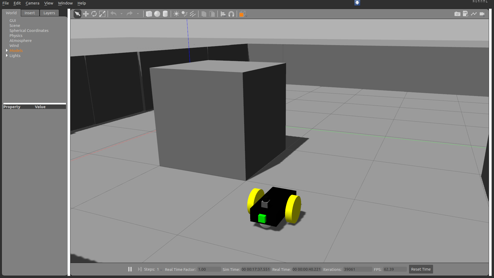
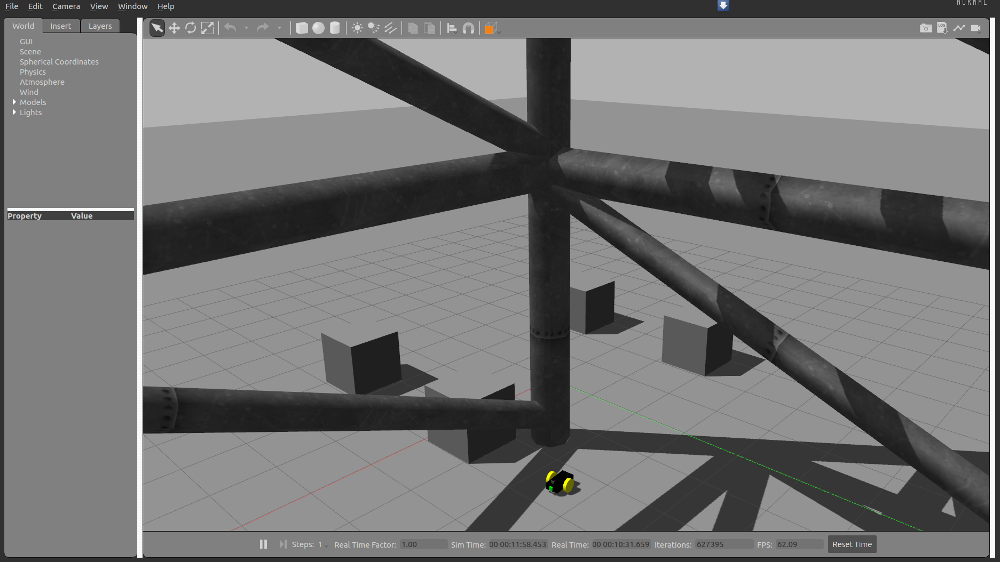

# spcbot 
#### This Repo contains the code for the following ROS Gazebo tutorials [Youtube Playlist](https://www.youtube.com/playlist?list=PL0cxiXoTD1yprQ-KsUF50xGoGqx1strJ3)

**Note:** please ignore the **spcbot_navigation** package because its not included the tutorials yet and need some cleanup


```console
    $ roslaunch spcbot_gazebo spcbot_complete_boxs.launch 
```





```console
    $  roslaunch spcbot_description rviz.launch 
```


```console
    $ roslaunch spcbot_gazebo spcbot_random.launch 
```

